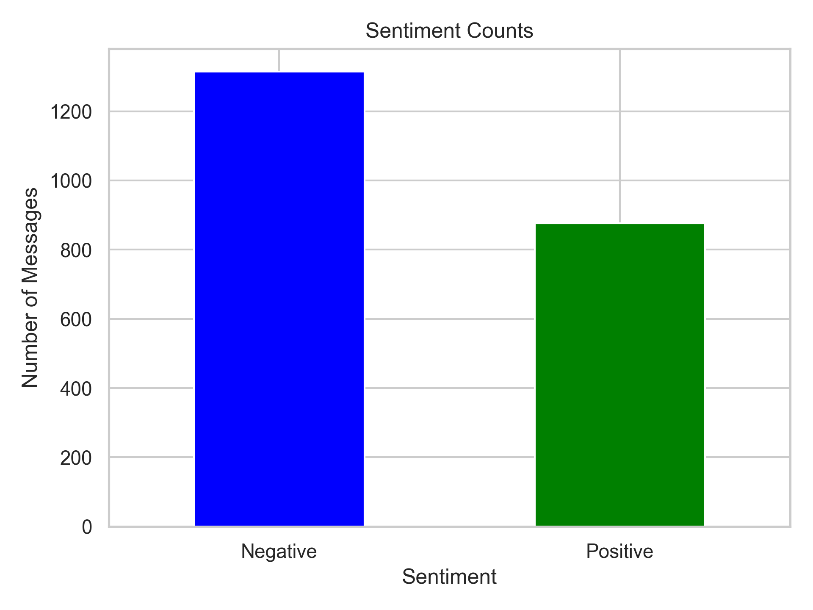
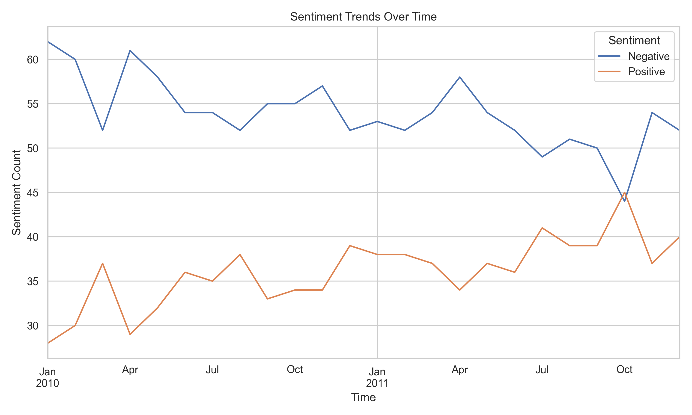
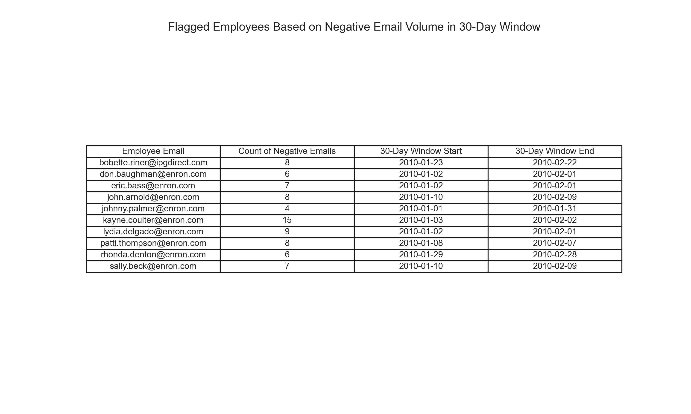

# 📊 Employee Sentiment Analysis

## 🎯 Goal
This project analyzes an unlabeled dataset of employee messages to assess sentiment and engagement.  
We used **NLP** and statistical techniques to classify messages into **Positive**, **Negative**, or **Neutral** sentiment categories and derive actionable insights.

---

## 🛠️ Tools & Libraries
- Python  
- [Transformers](https://huggingface.co/docs/transformers/index) (`pipeline`)  
- `pandas`, `numpy`, `re`  
- `sklearn` (CountVectorizer, LinearRegression, train_test_split, metrics)  
- `matplotlib`, `seaborn`  
- `collections`, `datetime`  

---

## 🔍 Approach and Methodology
1. **Data Cleaning**  
   - Removed formatting artifacts, newline characters, and empty/whitespace messages.

2. **Sentiment Analysis**  
   - Rule-based scoring:  
     - Positive = +1  
     - Negative = –1  
     - Neutral = 0  

3. **Aggregation**  
   - Monthly sentiment scores calculated per employee.

4. **Ranking**  
   - Top/bottom performers identified monthly based on sentiment.

5. **Flight Risk Analysis**  
   - Flagged employees with **≥4 negative emails** in a 30-day rolling window.

6. **Predictive Modeling**  
   - Built linear regression models for sentiment trend forecasting.
   - Integrated **NLP features** (polarity, subjectivity) for improved performance.

---

## 📈 Key Insights
- Most communications were informal internal conversations with occasional negative tone.
- Positive messages were still common, showing a mixed workplace sentiment.
- A few employees consistently contributed negative sentiment.
- **Flight Risk Detection** flagged employees showing consistent drops in sentiment.

---

## 📊 Visuals
- Sentiment counts and monthly sentiment trends.

- Monthly **top 3 positive** and **bottom 8 negative** employee rankings.

- Flight risk detection tables with flagged date ranges.

- Predictive modeling performance charts.

---

## 🤖 Modeling Results
| Model                | MSE  | R² Score | Notes                              |
|----------------------|------|----------|-----------------------------------|
| Linear Regression    | 7.46 | –0.03    | Poor fit, insufficient features.  |
| NLP-Enhanced Model   | 0.86 | 0.08     | Improved accuracy, low R².        |

> Further modeling (e.g., decision trees, ensemble methods) is recommended for better predictive power.

---

## ✅ Recommendations
- Monitor employees flagged for recurring negative sentiment to improve engagement.
- Incorporate **HR records** or workload metrics for more accurate forecasting.
- Experiment with **advanced ML models** for improved sentiment prediction.

